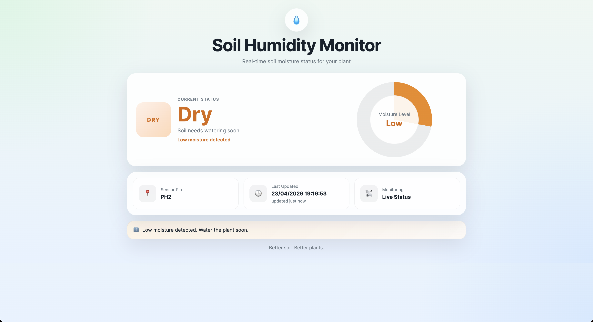
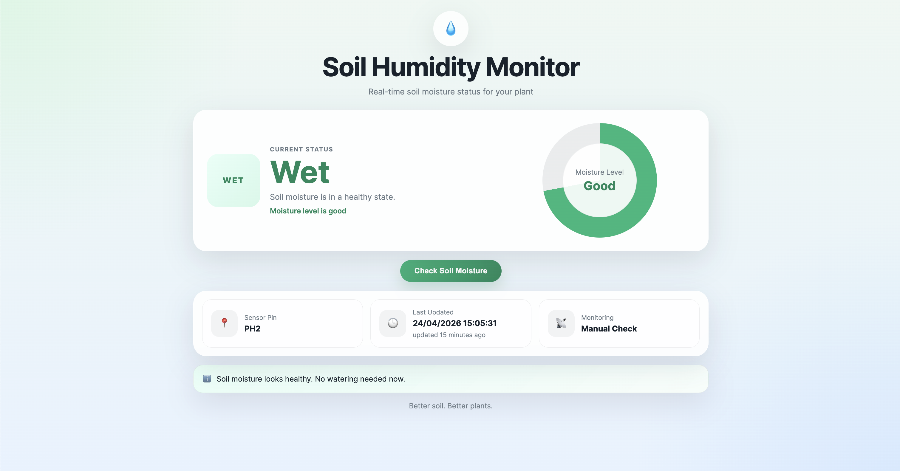

# WS25_Prak_YutongXie

## Project Overview

This project aims to implement an automated soil moisture monitoring and irrigation system by integrating hardware devices, embedded-side code, service communication, workflow orchestration, and a user interface into one complete project. The system mainly consists of a soil moisture sensor, an Orange Pi, services deployed on Lehre, CPEE workflow models, robot-related programs, and a front-end interface.

## Project Workflow

The core implementation of this project is a complete communication workflow for soil moisture data, spanning from the Orange Pi to Lehre and finally to CPEE.

First, the soil moisture sensor data is collected on the Orange Pi, where the corresponding service interface is also implemented. Since Lehre cannot directly access the Pi because it is located within a private network, port `18080` on the Orange Pi was forwarded to Lehre. This enabled Lehre to access the data interface hosted on the Orange Pi, allowing CPEE to send requests to the Orange Pi via Lehre and retrieve the current soil moisture status.

Instead of adopting a continuous periodic data-pushing mechanism, this project uses an on-demand communication model: the Orange Pi reads and transmits the current data only when a request is issued by CPEE. This approach avoids unnecessary repeated transmissions and reduces overall system resource consumption.

## Repository Structure

This repository contains the main files of the project, including the CPEE model, robot programs, the Lehre-side interface, and the Orange Pi code.

```text
.
├── README.md
├── cpee/
│   └── gustav.xml
├── robot_programs/
│   ├── home.urp
│   └── watering.urp
├── lehre_code/
│   └── humidity.html
├── orange_pi/
│   └── soil_sensor.py
└── media/
    └── demo_video_link.txt
    └── dry.png
    └── wet.png

## UI Showcase

The user interface of this project is designed to display the current soil moisture status in a clear and intuitive way.  
Instead of showing the raw sensor values (`0` / `1`), the interface presents human-readable states: **Dry** and **Wet**.

The UI provides the following information:

- **Current Status**: Displays whether the soil is currently dry or wet
- **Moisture Level**: Visualized with a circular indicator
- **Sensor Pin**: Shows the connected sensor pin
- **Last Updated**: Displays the latest timestamp of the received data
- **Monitoring Status**: Indicates that the system is running in live monitoring mode
- **Status Message**: Provides a short explanation of the current soil condition

### Dry State UI

This page is shown when the sensor detects a dry soil condition.  
The interface highlights the dry state and indicates that watering is needed soon.



### Wet State UI

This page is shown when the sensor detects a wet soil condition.  
The interface indicates that the soil moisture is in a healthy state and no watering is needed.



## Notes

This repository is for academic project use only. Unauthorized redistribution or commercial use of the project materials is not permitted.

## Author

Technical University of Munich (TUM)  
Yutong Xie  
Student ID: ge94zaj
